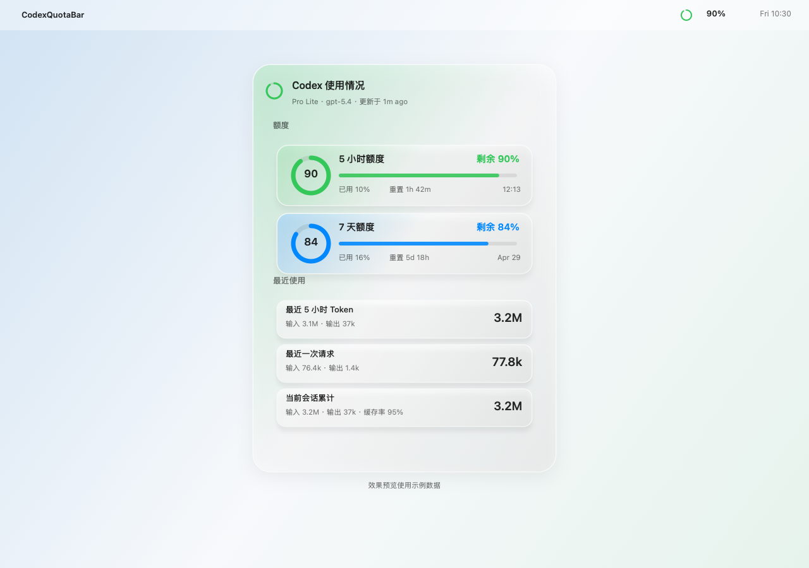
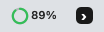

# CodexQuotaBar

CodexQuotaBar is a lightweight macOS menu bar app for keeping an eye on local Codex usage. It reads `token_count` events from your local `~/.codex/sessions` logs and turns them into a small status-ring icon plus a click-to-open quota dashboard.

The app is designed for quick scanning: the menu bar item shows the remaining 5-hour quota, and the popover opens to the two quota windows that matter most: 5 hours and 7 days.

<p>
  
</p>

<p>
  
</p>

## Features

- Menu bar ring icon with remaining 5-hour quota.
- Popover dashboard for 5-hour and 7-day quota windows.
- Rolling token totals for the last 5 hours and 7 days.
- Latest request and active-session token summaries.
- Right-click menu with settings, refresh, log folder, single-instance cleanup, and quit.
- Language setting with Chinese and fully English UI modes.
- Native macOS SwiftUI UI with material/glass-style surfaces.
- Local-only data access: no server, account token, or network request is needed to read usage.

## Requirements

- macOS 13 or newer.
- Swift 6.2 or newer for building from source.
- Codex desktop/CLI usage logs under `~/.codex/sessions`.

The liquid-glass visual polish uses newer SwiftUI APIs when the host macOS supports them, with a material fallback on older supported systems.

## Build

```bash
./scripts/build_app.sh
```

The app bundle is written to:

```text
dist/CodexQuotaBar.app
```

Launch it with:

```bash
open dist/CodexQuotaBar.app
```

For development builds:

```bash
swift build
swift run CodexQuotaBar
```

## How It Works

Codex writes local JSONL session logs. Some lines include `payload.type == "token_count"` and carry:

- `rate_limits.primary`: the 5-hour usage window.
- `rate_limits.secondary`: the 7-day usage window.
- `info.last_token_usage`: the most recent request token counts.
- `info.total_token_usage`: the active session's accumulated token counts.

CodexQuotaBar scans recent session files, picks the latest rate-limit event, and aggregates recent `last_token_usage` events for rolling token totals.

More detail: [docs/ARCHITECTURE.md](docs/ARCHITECTURE.md)

## Privacy

CodexQuotaBar only reads local files from:

```text
~/.codex/sessions
~/.codex/config.toml
```

It does not upload logs, call OpenAI APIs, or send telemetry. The GitHub project intentionally excludes build output and local Codex data.

More detail: [docs/PRIVACY.md](docs/PRIVACY.md)

## Project Layout

```text
Sources/CodexQuotaBar/
  App/       app lifecycle, menu bar coordinator, popover behavior
  Data/      log scanning, usage store, data models
  UI/        SwiftUI popover, settings, ring rendering
  Support/   preferences and single-instance helpers
scripts/    build scripts
docs/       architecture and privacy notes
```

## License

MIT. See [LICENSE](LICENSE).
